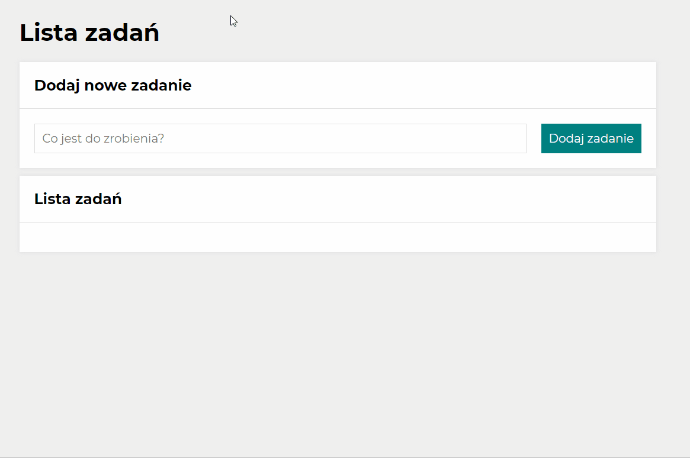

# To-Do List

## Demo

https://kacperszemraj.github.io/to-do-list/

## Description

This is a simple task list created for educational purposes. The current version includes adding tasks, marking the selected ones as completed and the possibility to delete the selected task.

## How to use

1. Enter the task content
2. Click on the button "Dodaj zadanie"
3. The task will be added to the task list
4. Click on the green button on the left to mark the task as completed
5. Click on the red button on the right to delete the task

## Technologies

- HTML
- CSS
- JavaScript

## Methodologies

- BEM
